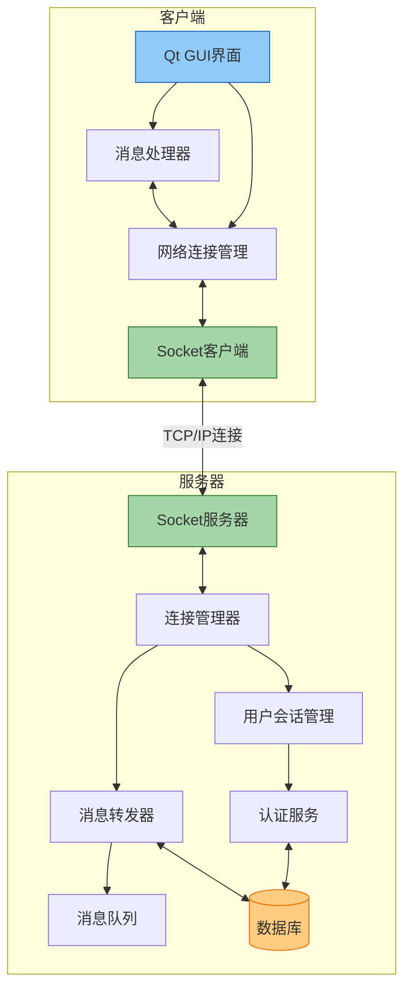
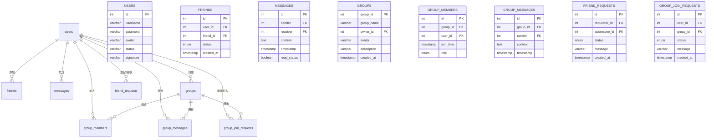

# QQ聊天应用

## 项目概述
这是一个基于Qt和C++开发的即时通讯应用程序，类似于腾讯QQ。该应用支持用户注册、登录、添加好友、创建群聊以及实时消息交流等功能。项目采用客户端-服务器架构，使用MySQL数据库存储用户信息、消息记录和好友关系等数据。应用实现了完整的网络通信框架，支持消息的实时传输和多用户在线交互。

## 主要功能
- **好友系统**：可添加、删除好友，管理好友申请
- **私聊功能**：支持一对一实时消息交流
- **群聊系统**：
  - 创建和管理群聊
  - 发送群聊消息
  - 申请加入群聊
  - 管理群成员
- **消息记录**：保存并显示历史消息记录
- **系统通知**：好友申请、群聊邀请等系统通知功能
- **网络通信**：
  - 支持TCP/IP网络协议
  - 实现客户端与服务器的实时消息传输
  - 处理多客户端并发连接
  - 离线消息存储与推送

## 技术栈
- **开发语言**：C++
- **GUI框架**：Qt 6
- **数据库**：MySQL
- **网络通信**：Qt Network模块、自定义通信协议
- **开发环境**：Windows/Visual Studio
- **版本控制**：Git/GitHub

## 网络架构
项目采用经典的C/S（客户端/服务器）架构：
- **服务器端**：
  - 处理客户端连接请求
  - 管理用户登录状态
  - 转发消息到目标用户
  - 将消息持久化到数据库
  - 提供群组和好友管理服务
- **客户端**：
  - 提供用户交互界面
  - 建立与服务器的TCP连接
  - 发送和接收消息
  - 本地消息缓存
  - 断线重连机制

### 网络架构图


## 通信协议
自定义的应用层协议，基于JSON格式：
- 消息类型标识
- 发送者和接收者信息
- 消息内容
- 时间戳
- 消息ID
- 状态码和错误信息

## 数据库设计
应用使用MySQL数据库(8.0+)，主要表结构包括：

### 数据库关系图


## 项目结构
```
qqProject_001/
├── main.cpp                 # 程序入口
├── mainWindow.cpp/h         # 主窗口实现
├── loginDialog.cpp/h        # 登录对话框
├── registerDialog.cpp/h     # 注册对话框
├── chatWindow.cpp/h         # 聊天窗口
├── groupChatWindow.cpp/h    # 群聊窗口
├── addFriendDialog.cpp/h    # 添加好友对话框
├── createGroupDialog.cpp/h  # 创建群聊对话框
├── FindFriendGroup.cpp/h    # 好友和群组查找功能
├── networkManager.cpp/h     # 网络连接管理
├── messageHandler.cpp/h     # 消息处理
├── socketClient.cpp/h       # 客户端Socket实现
└── resources/               # 资源文件夹
```

## 项目亮点
- 使用Qt信号槽机制实现界面与逻辑分离
- 采用预处理SQL语句防止SQL注入
- 实现了完整的好友和群聊管理系统
- 基于TCP协议的高效网络通信框架
- 自定义协议实现消息可靠传输
- 支持断线重连和心跳检测
- 良好的错误处理和用户反馈机制
- 简洁直观的用户界面

// ... existing code ...

## 开发过程中解决的问题
- 解决了群聊消息发送时的字段名不匹配问题
- 修复了非群组成员可以查看群组的漏洞
- 优化了消息列表和群组列表的加载效率
- 增强了调试信息，便于排查问题
- 解决了多客户端并发连接的稳定性问题
- 优化了网络通信效率，减少数据传输延迟
- 实现了消息的可靠投递机制

## 未来计划
- 添加文件传输功能
- 实现消息加密
- 支持语音和视频通话
- 优化UI/UX设计
- 添加更多社交功能
- 实现分布式服务架构，提高系统容量
- 添加消息推送和通知机制
- 集成第三方社交平台登录

